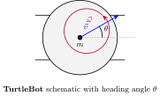
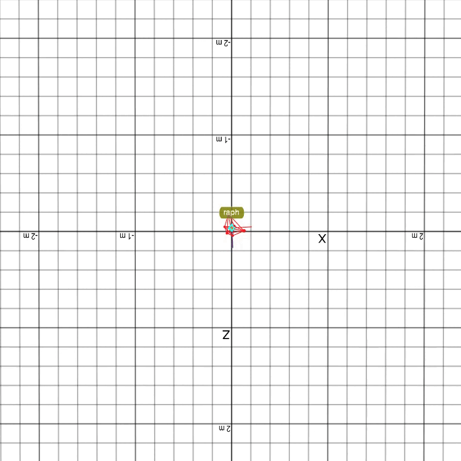

# dynamicalnodes: Control Systems on ROS 2

> _"Give me a [control system] long enough and a [computer] on which to place it, and I shall move the world."_ - Archimedes 

**dynamicalnodes** is a Python development framework that bridges the gap between novel control systems and their implementation onto ROS 2. Designed for hobbyists, students, and academics alike, this framework won't cure cancer, but it can do the next best thing: make robotics easier.

To get started, or to explore what this framework has to offer, click here: [dynamicalnodes Documentation](https://nehalsinghmangat.github.io/dynamicalnodes).

For a 22 second video describing this framework's intended workflow for, click here: [SAIL 2025 -- Presenting dynamicalnodes](https://youtu.be/5GbVHo6QZrw).

---
## Turtlebot: Whiteboard ⟶ Python ⟶ ROS 2 ⟶ World
<table>
  <tr>
    <td align="center">
       
    </td>
    <td align="center">
       
    </td>
    <td align="center">
       
    </td>
    <td align="center">
       
    </td>
  </tr>
</table>

  

