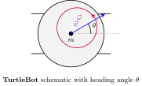
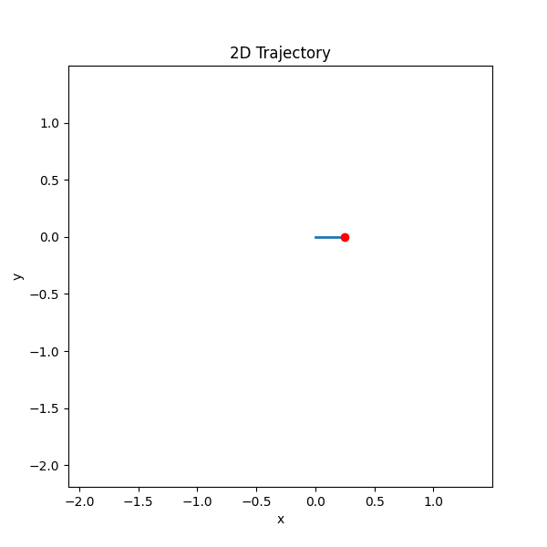
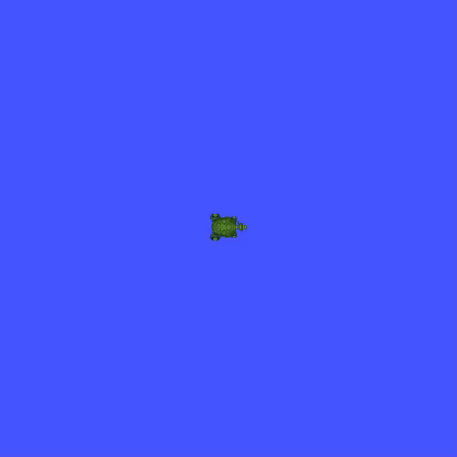

# dynamicalnodes: A Python Framework for Discrete-Time Control Systems on ROS 2

> _"All the world's a [control system], and all the men and women merely [control systems]."_ - William Shakespeare (paraphrased)

> _"An idiot admires complexity; a genius admires [control systems]."_ - Terry Davis (paraphrased)

> _"Give me a [control system] long enough and a [computer] on which to place it, and I shall move the world."_ - Archimedes (paraphrased)

**dynamicalnodes** is a Python development framework that bridges the gap between control systems and their implementation onto ROS 2. Designed for hobbyists, students, and academics alike, this framework won't cure cancer, but it can do the next best thing: make robotics easier.

To get started, or to explore what this framework has to offer, click here: [dynamicalnodes Documentation](https://nehalsinghmangat.github.io/dynamicalnodes).

For a 22 second video describing this framework's intended workflow for, click here: [SAIL 2025 -- Presenting dynamicalnodes](https://youtu.be/5GbVHo6QZrw).

---
## Turtlebot: Whiteboard -> Python -> ROS -> World
<table>
  <tr>
    <td align="center">
       
    </td>
    <td align="center">
       
    </td>
    <td align="center">
       
    </td>
    <td align="center">
       
    </td>
  </tr>
</table>

  

