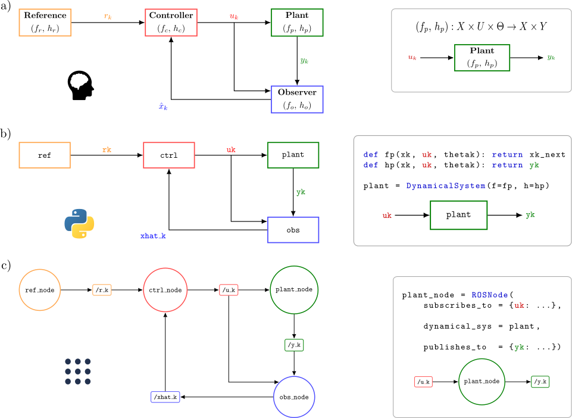

dynamicalnodes
==============

**dynamicalnodes** is a Python framework for modeling control systems as discrete-time diagrams and then deploying them as ROS2 nodes.

To get started, :doc:`install the package <installation>` and begin the :doc:`first tutorial <tutorials/0_cruise_control/0_cruise_control>`.

.. warning::

   This website is a work in progress. Proceed at your own risk.

.. toctree::
   :hidden:

   installation
   tutorials/index
   fh_library/index   
   api/index
   license

   Overview of the **dynamicalnodes** framework and correspondence between discrete-time diagrams and ROS~2 node topologies. a) The discrete block diagram of an abstract feedback system. Each block represents a DTDS; the wires represent the inputs/outputs to other blocks. b) A feedback system implemented via **DynamicalSystem** objects. Each object encapsulates an (f,h) pair implemented in Python. The input/output wires are implemented by setting the output of one object as an input to another. c) A feedback system implemented via ROS nodes. Each node contains the Python (f,h) pair tested in the previous step. The input/output wires become subscriptions/publications to topics. Data handling (such as type translation and concurrency) is abstracted away with the help of the **ROSNode** class.
