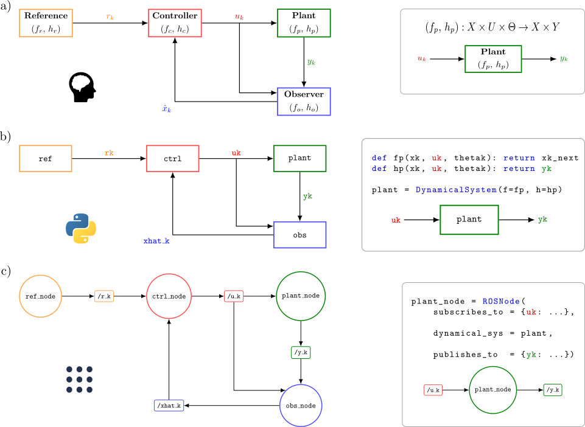

dynamicalnodes
==============

**dynamicalnodes** is a Python framework for modeling control systems as discrete-time diagrams and then deploying them as ROS2 nodes.

To get started, :doc:`install the package <installation>` and begin the :doc:`tutorial <tutorials/index>`.

.. warning::

   This website is a work in progress. Proceed at your own risk.

.. toctree::
   :hidden:

   installation
   tutorials/index
   fh_library/index   
   api/index
   license

   Overview of the **dynamicalnodes** framework and correspondence between discrete-time diagrams and ROS~2 node topologies. a) The discrete block diagram of an abstract feedback system. b) A feedback system implemented via **DynamicalSystem** objects. c) A feedback system implemented in ROS via the **ROSNode** class. 
