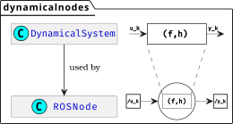

Tutorials
=========
This is a series of tutorials designed to get you acquainted with the ``dynamicalnodes`` package. The ``dynamicalnodes`` package is composed of two classes: the ``DynamicalSystem`` class and the ``ROSNode`` class. The former serves as a framework for composing discrete-time diagrams, while the latter serves as a conveinient wrapper for generating ``rclpy`` files.

   The UML class diagram of the ``dynamicalnodes`` package.

Modeling Systems with ``DynamicalSystem``
-----------------------------------------
This tutorial walks through the ``DynamicalSystem`` class. We begin with a basic example -- the humble pendulum -- and show how to model it as a ``DynamicalSystem`` object.  We then show how to model the behaviour of a pendulum under an external input as a composition of two ``DynamicalSystem`` objects, and finally extending this idea to modeling the classic problem of balancing an inverted pendulum.

.. list-table::
   :widths: 30 30 40
   :align: center

   * - .. figure:: ../_static/figures/pendulum_torque.svg
          :width: 100%

          :doc:`Plant <modeling/plant>`
     - .. figure:: ../_static/figures/pendulum_autonomous.svg
          :width: 100%

          :doc:`Plant with Input <modeling/plant_with_input>`
     - .. figure:: ../_static/figures/feedback_pendulum.svg
          :width: 100%

          :doc:`Feedback System <modeling/plant_feedback_system>`

.. toctree::
   :maxdepth: 2
   :hidden:

   modeling/plant
   modeling/plant_with_input
   modeling/plant_feedback_system

Implementing Systems in ROS/Gazebo via ``ROSNode``
--------------------------------------------------
This tutorial walks through the ``ROSNode`` class. We begin by implementing a signal generator as a ``DynamicalSystem`` object, and then wrapping that object in a ``ROSNode`` object. We will see how the ``ROSNode`` object can be written to a standalone ``rclpy`` file. We then model the scenario of two sensors publishing data at different rates for two different observers. Finally, we cast the inverted pendulum balancing system in the previous tutorial as a ROS graph, where we can tune the PID live and even visualize the system using ``Gazebo`` ROS.

.. list-table::
   :widths: 25 48 27
   :align: center

   * - .. figure:: ../_static/figures/ros_signal.svg
          :width: 100%

          Signal Generator
     - .. figure:: ../_static/figures/sync.svg
          :width: 100%

          Sync Modes
     -

.. toctree::
   :maxdepth: 2

Miscellaneous (but potentially enlightening) Examples
-----------------------------------------------------

.. toctree::
   :maxdepth: 2
   :caption: Examples

   0_cruise_control/0_cruise_control
   1_gps_imu/1_gps_imu
